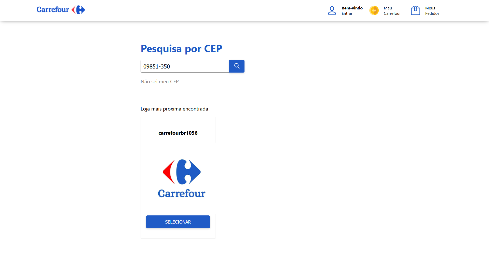

# Carrefour Techday

## Descrição

Este projeto permite encontrar uma loja Carrefour mais próxima e ver os produtos disponíveis que ela possui. Utiliza [React](https://pt-br.reactjs.org/) no front-end e possui um back-end feito com [Express](https://expressjs.com/pt-br/).

---

## Instalação

> OBS.: É necessário ter o Node.js instalado

Entre no diretório raiz do projeto utilizando o terminal e instale as dependencias do arquivo `package.json` utilizando o comando: `npm install`

---

## Uso

Primeiramente inicie o servidor `server.js` utilizando o comando `npm run server`. Este servidor roda no endereço `http://localhost:5000` e permite fazer as requisições na API do Carrefour sem ocorrer o bloqueio [CORS](https://developer.mozilla.org/pt-BR/docs/Web/HTTP/CORS).

O próximo comando a ser executado é `npm run dev` para permitir ver a página web no endereço `http://localhost:3000`.

Agora digite um CEP na caixa de texto e aperte o botão que possui um ícone de lupa para encontrar uma loja Carrefour mais próxima.

Clique em selecionar para carregar os produtos

---

## Endpoints

O servidor `src/server.js` possui dois endpoints, o primeiro retorna as lojas e o segundo endpoint retorna os produtos.

### **Lojas**

Requisição: GET

`/sellers?postalCode={postalCode}`

Parâmetro `postalCode` &rarr; Número inteiro representando um CEP (sem hifens). Exemplo: `09851350`

### **Produtos**

Requisição: GET

`/products?fq={sellerName}`

Parâmetro `fq` &rarr; Nome de uma loja Carrefour, ex.: `carrefourbr1056`